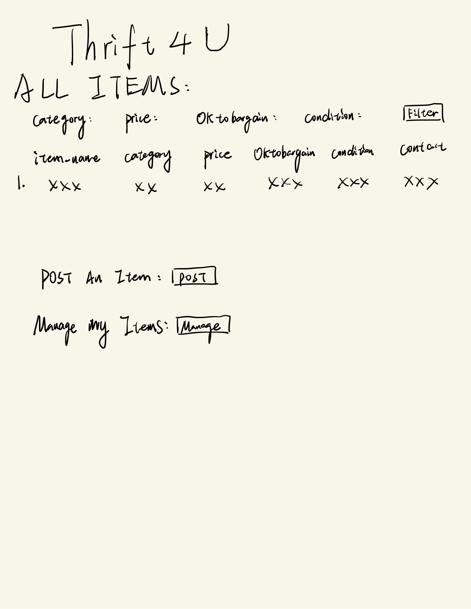
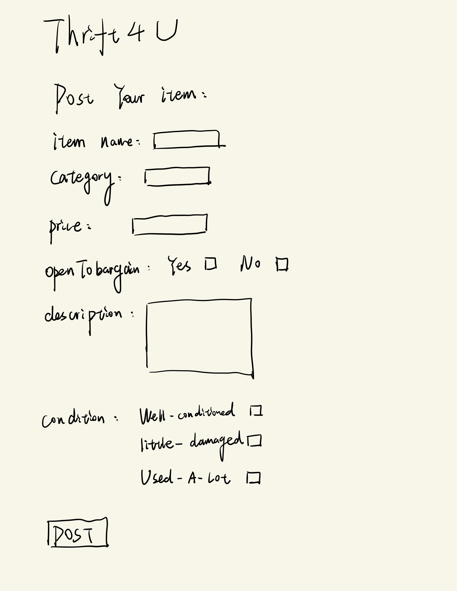
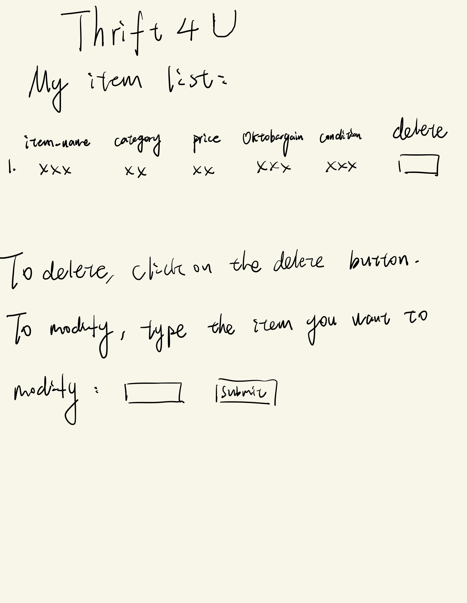
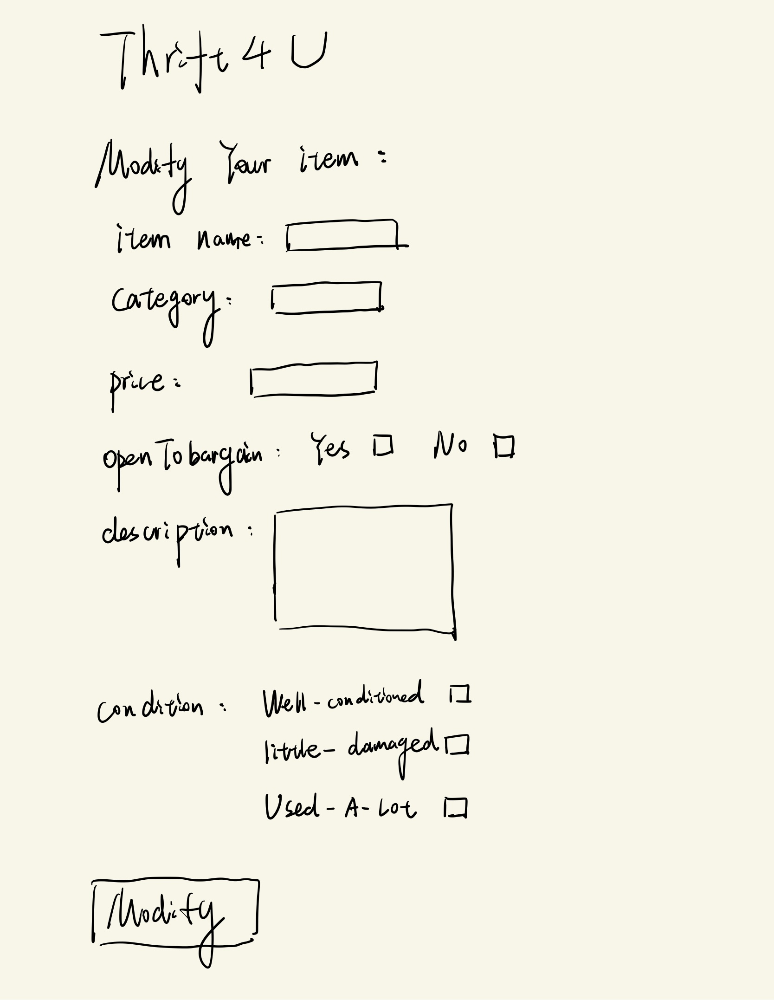

The content below is an example project proposal / requirements document. Replace the text below the lines marked "__TODO__" with details specific to your project. Remove the "TODO" lines.

# Thrift4U

## Overview

Students are usually short of budgets, so buying second-hand stuff becomes a temptating option for many of them. For students in China, they often use Wechat groups to do this, which is hard to track past records or search items by categories.

Thrift4U is a web app that functions as a platform for information of second-hand items for sale. Users can register and login. Once they log in, they can search the posted second-hand items and can filter the search options as they want. Moreover, if they want to sell somethimng that they don't need, they can also post them on this web app and manage them later on.


## Data Model

The application will store Users, Lists and Items

* users can have multiple lists (via references)
* each list can have multiple items (by embedding)


An Example User:

```javascript
{
  username: "JerryFranklin",
  password: 23241,
  contact: "Wechat: 13423455",
}
```

An Example Item:

```javascript
{
  ref: 'User' // a reference to a User object
  name: "Calculus101",
  category: "book",
  price: "1000",
  openTobargain: true,
  description:"A textbook for beginners to learn Calculus",
  condition:"Well conditioned",
}
```


## [Link to Commented First Draft Schema](db.mjs) 

## Wireframes

/list- page for listing all existing items



/list/post - page for posting one item



/list/mylist - page for showing all the items posted by the user



/list/mylist/modify - page for modifying the infomation of an item posted by the user



## Site map


## User Stories or Use Cases

1. as non-registered user, I can register a new account with the site
2. as a user, I can log in to the site
3. as a user, I can see the infomation of all the available items for sale
4. as a user, I can modify the filters to search for the items I want. 
5. as a user, I can post a item that I want to sell
6. as a user, I can check the list of all the items that I want to sell and modify their attributes if necessary or even remove them. 

## Research Topics

* (2 points) Use a CSS framework found in Semantic UI to make my website neat and beautiful
* (3 points) Perform client side form validation using a JavaScript library
* (3 points) Using a client side javascript we did not cover in class
    * I have not figured what it is yet, but I guarantee it will take a LOT of effort. 
* (2 points) Using a sever side javascript we did not cover in class
    * I have not figured what it is yet, but I guarantee it will take a LOT of effort. 

10 points total out of 8 required points 


## [Link to Initial Main Project File](app.mjs) 

## Annotations / References Used
Need to be updated later

