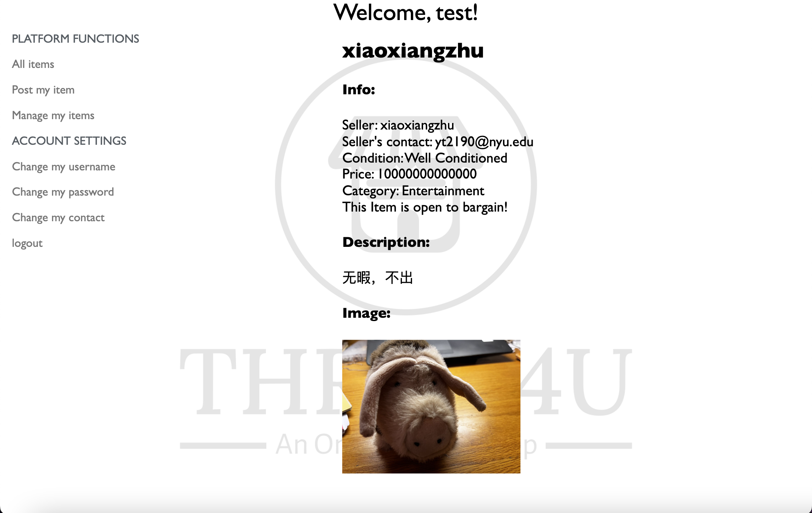
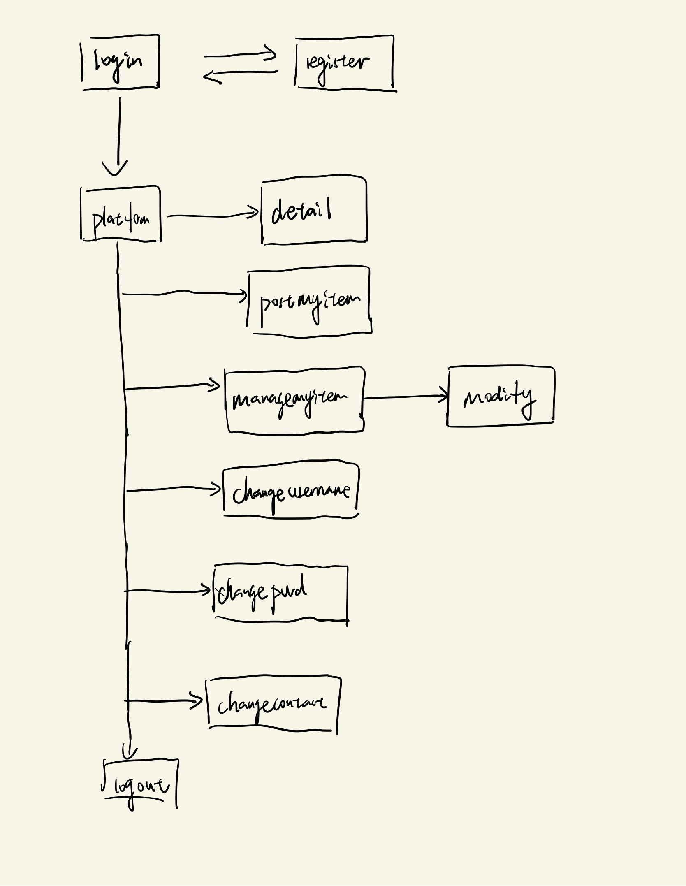

# Thrift4U

## Overview

Students are usually short of budgets, so buying second-hand stuff becomes a temptating option for many of them. For students in China, they often use Wechat groups to do this, which is hard to track past records or search items by categories.

Thrift4U is a web app that functions as a platform for information of second-hand items for sale. Users can register and login. Once they log in, they can search the posted second-hand items and can filter the search options as they want. Moreover, if they want to sell somethimng that they don't need, they can also post them on this web app and manage them later on.


## Data Model

The application will store Users, and Items

* users can have multiple items 
* but item can only have one user(via references)


An Example User:

```javascript
{
  username: "JerryFranklin",
  password: 23241,
  contact: "Wechat: 13423455",
}
```

An Example Item:

```javascript
{
  seller: {
    type: mongoose.Schema.Types.ObjectId,
    ref: 'User'
  },// a reference to a User object
  name: "Calculus101",
  category: "Education",
  price: 1000,
  openTobargain: true,
  description:"A textbook for beginners to learn Calculus",
  condition:"Well conditioned",
  imagepath:String,
  range: String,
}
```


## [Link to Commented First Draft Schema](db.mjs) 

## Wireframes

/platform- page for listing all existing items


/detail- page for showing the details of the item


/postmyitem - page for posting one item


/managemyitems - page for showing all the items posted by the user


/changeusername - page for users to change their usernames


/changepassword - page for users to change their passwords


/changepassword - page for users to change their contacts


## Site map




## User Stories or Use Cases

1. as non-registered user, I can register a new account with the site
2. as a user, I can log in to the site
3. as a user, I can see the infomation of all the available items for sale.
4. as a user, I can modify the filters to search for the items I want. 
5. as a user, I can post a item that I want to sell.
6. as a user, I can check the list of all the items that I want to sell and modify their attributes if necessary or even remove them. 
7. as a user, I can change my username.
8. as a user, I can change my password.
9. as a user, I can change my contact.
10. as a user, I can see the details of an item

## Research Topics

* (2 points) Use a CSS framework (PURE) to form a consistent theme.
* (3 points) Using a server side javascript we did not cover in class
    * I choose to use Passport.js for user authentication. 
* (5 points) External API
    * I decided to use multer to enable the user to upload their images to the server, and combine it with mongoose to make it appear on the site. 

10 points total out of 10 required points 


## [Link to Initial Main Project File](app.mjs) 

## Annotations / References Used
Official Document for PURE.css: https://purecss.io
Official Document for Passport.js: https://www.passportjs.org
Official Document for Multer.js: https://www.npmjs.com/package/multer


